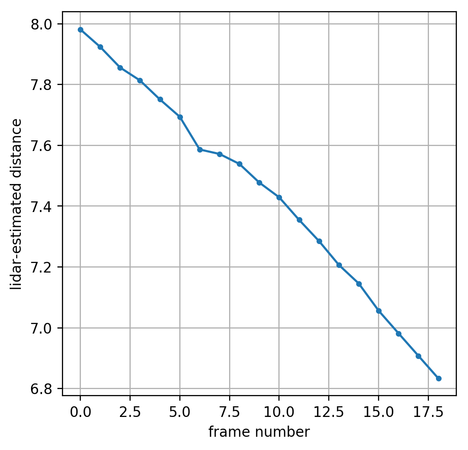
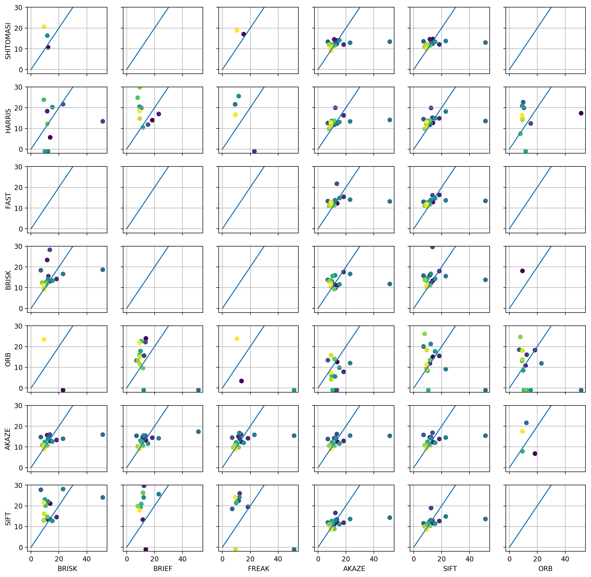

# SFND 3D Object Tracking

> In this final project, you will implement the missing parts in the schematic. To do this, you will complete four major tasks: 
# First, you will develop a way to match 3D objects over time by using keypoint correspondences. 

FP1: Done in two stages; first, `assignKeypointsToBoxes` stores in every box a vector of all the keypoints that belong to it,
and a set of these keypoints' indices. 

Secondly, `matchBoundingBoxes` uses that set to select best bounding box matches. That is itself done in two stages: first, 
I create a nested map `{prevBoxId: {currBoxId: matchCount}} ` in which I accumulate all the counts of the matching keypoints.
Then for every prevBoxId I select the currBoxId with the best match count; however that is not enough as we don't want 
different prevBoxes to match to the same currBox; so I store the results here as a map from currBoxId to a tuple
`{currBoxId: (prevBoxId, matchCount)}` and update that if I find a prevBox with a higher matchCount.

This way, I make sure that each prevBox, and each currBox, appears no more than once in the list of matches.

# Second, you will compute the TTC based on Lidar measurements. 

FP2: That's perhaps the easiest one. The only nontrivial part is robust distance estimation. I achieve that by first 
(within each box of course), sorting the lidar points by their x-y distance to zero, and then discaring the 3 nearest
points and taking the average of the 10 next distances. This should take care of isolated outlier points.

The rest is strictly by the book , lines 286-291 of `camFusion_Student.cpp`.

# You will then proceed to do the same using the camera, which requires to first associate keypoint matches to regions of interest and then to compute the TTC based on those matches. 
FP3: Here the only fun part was the outlier detection in  `clusterKptMatchesWithROI`. I look for outliers separately on the x 
and y dimensions, by calculating the mean and standard deviation of both in the same for-loop where I pre-select the 
matches belonging in the current box.

I then do a second pass over these, discarding those with delta x or delta y more than 2 standard deviations from the mean.
Doing the same using median and MAD would have been more robust, but also more computationally expensive, so I chose this path.

The rubric did say filter outliers based on the euclidean distance; but constraining distance on both x and y dimensions
also constrains euclidean distance, so this qualifies and is faster. 

FP4: This is a straightforward application of the lectures. Implemented a simplified median using `std::nth_element`
as this is more efficient than a full sort.

# And lastly, you will conduct various tests with the framework. Your goal is to identify the most suitable detector/descriptor combination for TTC estimation and also to search for problems that can lead to faulty measurements by the camera or Lidar sensor. 
FP5: As lidar-based TTC is purely a function of estimated distance to nearest vehicle, let's look at the plot of the estimated distance frame by frame, for the SIFT/AKAZE combination (one of the robust ones).

We see that these roughly lie on a straight line, apart from frame 6 that for some reason is a bit ahead (possibly the car ahead
braked a little between frames 5 and 6). From this we 
would expect that the ttc estimated from frames (6,7) and (7,8) would be a lot larger (shallower slope -> lower estimated velocity)
and from frames (5,6) it would be somewhat smaller than the average; and this is in fact what happens (lidar ttcs of 7, 51, and 23, in that order). 

So I would actually say there is no case where the lidar-based TTC is way off, it's in all cases consistent with the relative
velocity and distance observed in that particular moment.

The data used to generate the graph are in `ttc_stats_2.csv`

FP6: Finally, I ran the code for all combinations of keypoint detector and descriptor, with the results presented below.
Each subplot is a particular detector/descriptor combination, as labelled; each dot corresponds to a frame; the x axis shows the lidar-based
TTC and the y axis the camera-based ttc. The color denotes frame number, with dark blue being frame 0 and yellow being the last
frame; so the lighter the later the frame. For ease of interpretation, I also plotted the x=y line on each subplot, and set all
negative TTCs to -1. 

A good result here would be a cluster of points close to each other and to the x=y line, with lighter points being closer to the origin.

The results are quite interesting. First of all, several combinations fail completely, because the boxes couldn't be matched 
correctly based on the keypoints/descriptors calculated. 

Secondly, the descriptor choice matters a lot more - with AKAZE and SIFT descriptors, pretty much all detectors work fine; 
with FREAK and BRIEF, none except AKAZE do; and none do for the ORB descriptor. 
The only keypoint detector which works well with almost all descriptors (except ORB) is AKAZE.

All scatterplots (except where that point is missing entirely due to failed box match) contain a point with lidar_ttc=51
and another one with lidar_ttc =23, corresponding to the dip in the previous graph discussed above.

Overall, I would choose the SIFT detector with the AKAZE descriptor, as that also performed well in the previous project
(comparing number of keypoints detected and described to speed).

The data used to generate the graphs are in `ttc_stats.csv`, the notebook used to produce the graphs is `Performance_visualization.ipynb`.